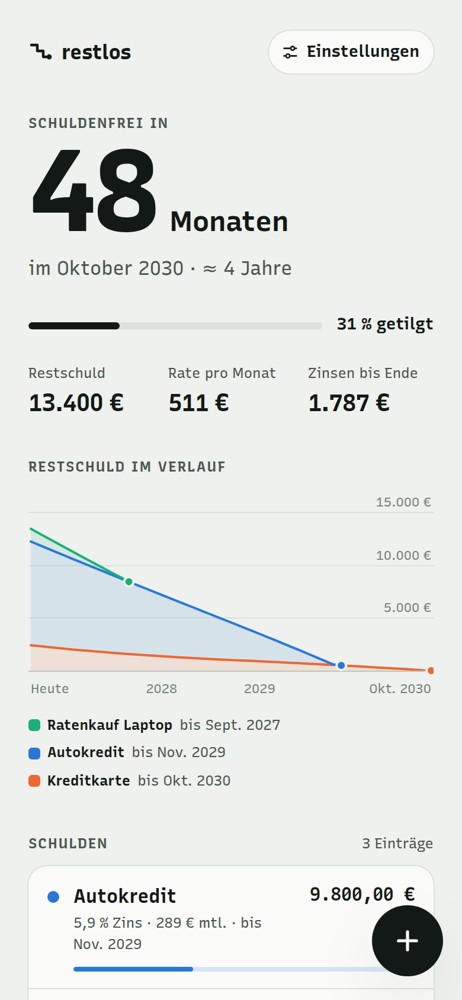
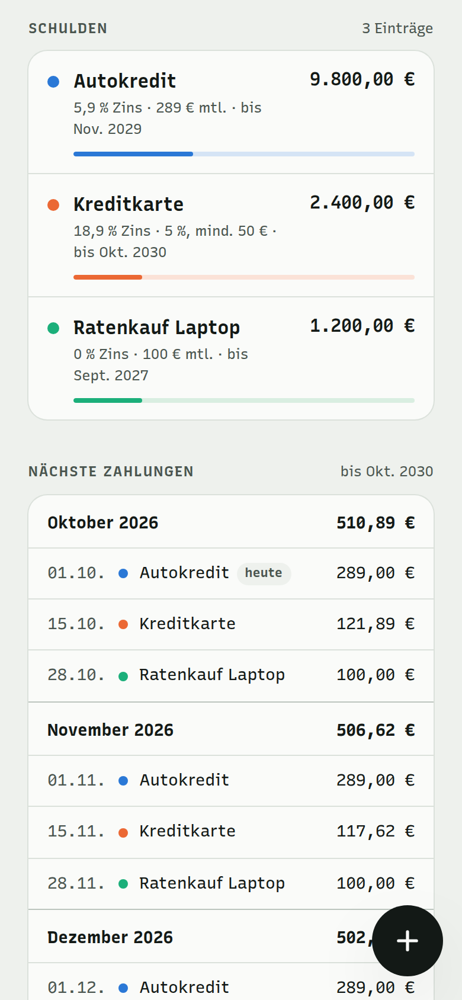
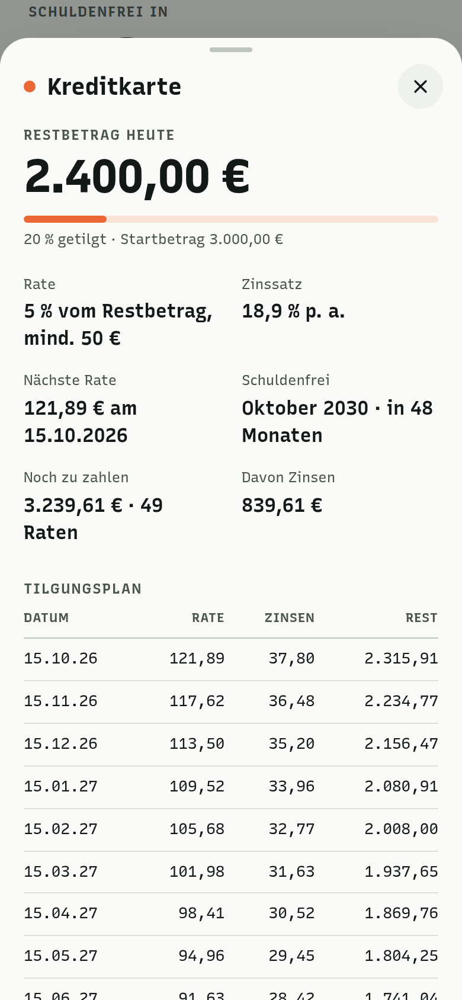
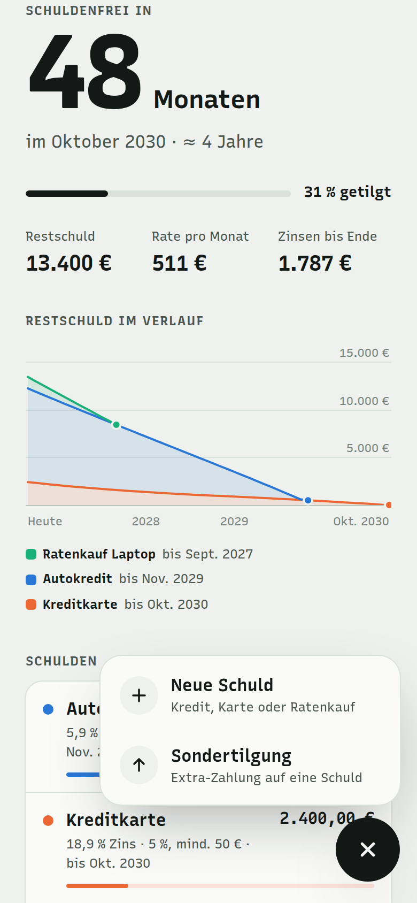
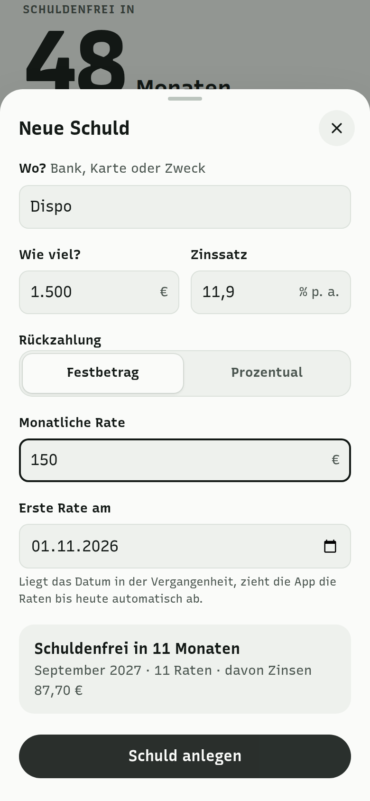
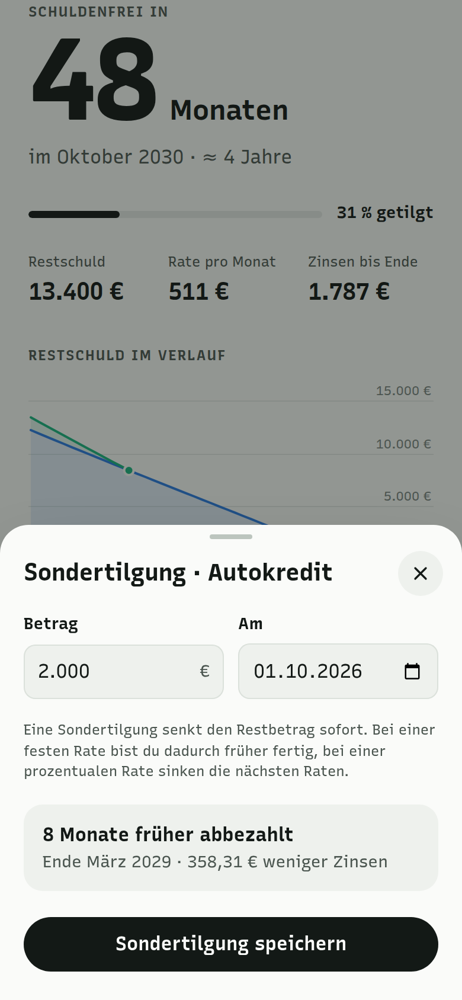
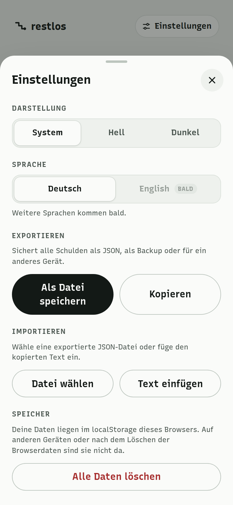
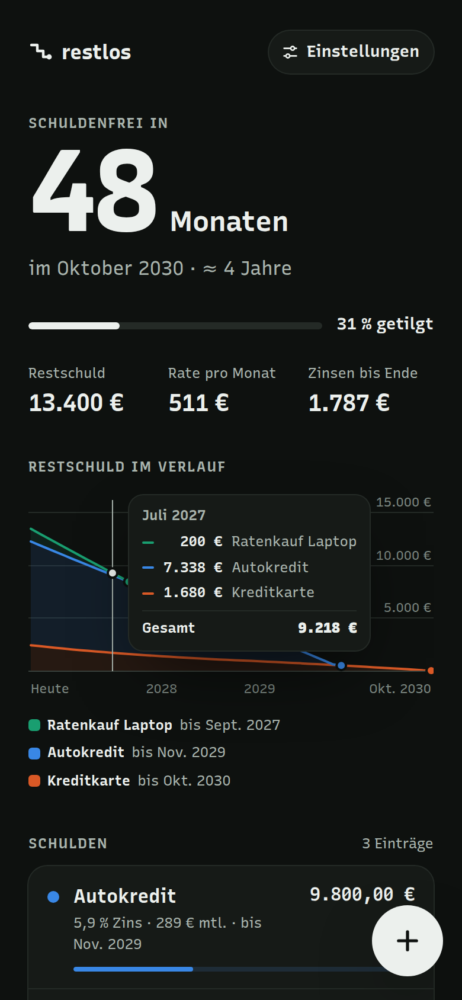

# restlos

Schulden-Tracker im Browser: Schulden erfassen, Tilgungsplan sehen und wissen, in wie vielen Monaten du schuldenfrei bist. Ohne Server, deine Daten bleiben lokal.

**[➜ Live ausprobieren](https://unpacked-dev.github.io/restlos/)** – beim ersten Öffnen siehst du Beispieldaten.

## Screenshots

| Übersicht | Schulden & Zahlungen | Tilgungsplan |
| :---: | :---: | :---: |
|  |  |  |

| Plus-Button | Neue Schuld | Sondertilgung |
| :---: | :---: | :---: |
|  |  |  |

| Einstellungen | Dunkelmodus |
| :---: | :---: |
|  |  |

## Funktionen

- **Countdown:** Wie viele Monate noch bis schuldenfrei, plus Monat der letzten Rate.
- **Überblick:** Restschuld, monatliche Rate gesamt, Zinsen bis zum Ende und Fortschritt in Prozent.
- **Verlauf:** Gestapeltes Diagramm der Restschuld je Schuld (mit Maus, Touch und Pfeiltasten bedienbar). Auf dem Handy bleibt der Tooltip stehen, bis du außerhalb der Grafik tippst.
- **Raten als Festbetrag oder prozentual** (z. B. Kreditkarte: 3 % vom Restbetrag, mindestens 25 €).
- **Restbetrag laut Bank:** Beim Bearbeiten trägst du den aktuellen Stand aus deinem Konto ein, die App rechnet ab der nächsten Rate damit weiter. So gleichst du Abweichungen durch tagesgenaue Zinsen oder Gebühren aus.
- **Ursprünglicher Betrag** (optional), damit „x % getilgt“ auch bei Krediten stimmt, die schon länger laufen.
- **Tilgungsplan** pro Schuld mit Rate, Zinsen und Restbetrag je Monat.
- **Sondertilgungen** über den Plus-Button oder in der Detailansicht einer Schuld, auch für die Zukunft geplant. Die Vorschau zeigt, wie viele Monate früher die Schuld abbezahlt ist und wie viel Zinsen du sparst.
- **Nächste Zahlungen** nach Monat gruppiert.
- **Warnungen**, wenn eine Rate die Zinsen nicht deckt oder die Tilgung über 50 Jahre dauert.
- **Einstellungen:** Darstellung (System, Hell, Dunkel), Sprache (weitere folgen) sowie Import / Export als JSON (Datei oder Zwischenablage), mit Ersetzen oder Ergänzen.

## Als App installieren (PWA)

restlos lässt sich wie eine App auf den Homescreen legen und funktioniert danach auch offline.

- **iPhone / iPad (Safari):** [Live-Version](https://unpacked-dev.github.io/restlos/) öffnen → Teilen-Symbol → „Zum Home-Bildschirm“.
- **Android (Chrome):** Menü → „App installieren“.
- **Desktop (Chrome / Edge):** Installieren-Symbol in der Adressleiste.

Updates kommen automatisch: Beim Start zeigt die App kurz einen Ladebildschirm und fragt beim Server nach einer neuen Version. Gibt es eine, wird sie geladen und die App startet neu („App aktualisiert“). Ohne Internet, ohne neue Version oder wenn der Server nach 10 Sekunden nicht antwortet, startet die App mit den gespeicherten Dateien. Nach 3 Sekunden kannst du den Check auch selbst überspringen.

> **Wichtig auf dem iPhone:** Die installierte App hat einen eigenen Speicher, getrennt von Safari. Daten, die du vorher in Safari eingegeben hast, sind dort nicht automatisch drin. Übertragen geht so: in Safari unter „Einstellungen“ → „Kopieren“, in der App → „Text einfügen“.

## So wird gerechnet

- Zinsen fallen monatlich an: Zinssatz p. a. ÷ 12 auf den Restbetrag, auf Cent gerundet.
- Prozentuale Raten beziehen sich auf den Restbetrag inklusive Monatszinsen, nie unter dem Mindestbetrag.
- Raten mit einem Datum vor heute gelten als bezahlt, Sondertilgungen bis einschließlich heute ebenso.
- Sondertilgungen senken den Restbetrag an ihrem Datum. Die Zinsen der nächsten Rate werden vereinfacht auf den gesenkten Betrag berechnet. Die Rate bleibt gleich (Festbetrag) bzw. sinkt mit dem Restbetrag (prozentual).
- Fällt die Rate z. B. auf den 31., wird sie in kürzeren Monaten am letzten Tag fällig.
- Die Prognose reicht höchstens 50 Jahre.

## Starten

Es gibt keinen Build-Schritt und keine Abhängigkeiten. Die App lädt nichts von externen Servern (auch keine Schriften).

`index.html` direkt im Browser öffnen oder einen kleinen lokalen Server starten:

```bash
python3 -m http.server 8000
# dann http://localhost:8000 öffnen
```

Läuft auch auf jedem statischen Hosting. Die Live-Version kommt per GitHub Pages direkt aus `main`.

## Projektstruktur

```
index.html          Markup
css/style.css       Styles, Farben (inkl. Dark Mode) und @font-face
js/theme.js         setzt Hell/Dunkel vor dem ersten Zeichnen
sw.js               Service Worker (offline, Update-Check)
js/update.js        Update-Check mit Ladebildschirm beim Start
manifest.webmanifest  App-Name, Farben und Icons für die Installation
js/app.js           Rechenlogik (zwischen LOGIC-START und LOGIC-END, ohne DOM) und Oberfläche
assets/fonts/       Recursive als WOFF2 (latin, latin-ext) + Lizenz
assets/favicon.svg  Icon
assets/icons/       App-Icons (PNG für iOS/Android, SVG-Vorlage)
docs/screenshots/   Bilder für diese README
```

## Daten

Alles liegt im `localStorage` deines Browsers unter dem Schlüssel `restlos.v1`. Auf anderen Geräten oder nach dem Löschen der Browserdaten sind die Daten weg, also ab und zu über „Import / Export“ sichern.

Export-Format:

```json
{
  "app": "Restlos",
  "version": 1,
  "exportedAt": "2026-10-01T08:00:00.000Z",
  "debts": [
    {
      "id": "d…",
      "name": "Autokredit",
      "amount": 9800,
      "startAmount": 15000,
      "rate": 5.9,
      "mode": "fixed",
      "payment": 289,
      "percent": 0,
      "minPayment": 0,
      "firstDue": "2026-11-01",
      "dueDay": 1,
      "color": 0,
      "createdAt": null,
      "extras": [
        { "id": "d…", "date": "2027-03-10", "amount": 1000, "settled": false }
      ]
    }
  ]
}
```

`mode` ist `"fixed"` (dann zählt `payment`) oder `"percent"` (dann zählen `percent` und `minPayment`).

`extras` sind die Sondertilgungen. `settled: true` heißt: Die Zahlung steckt schon im Betrag `amount`, weil die Schuld danach bearbeitet wurde. Sie wird dann nur noch angezeigt und nicht noch einmal abgezogen. Ältere Exporte ohne `extras` lassen sich weiter importieren.

Die gewählte Darstellung liegt separat unter `restlos.theme`.

## Lizenzen

- Code: siehe [LICENSE](LICENSE).
- Schrift [Recursive](https://github.com/arrowtype/recursive): SIL Open Font License 1.1, siehe [assets/fonts/OFL.txt](assets/fonts/OFL.txt).
